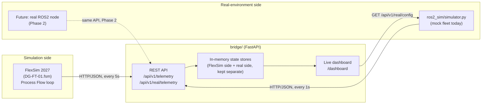
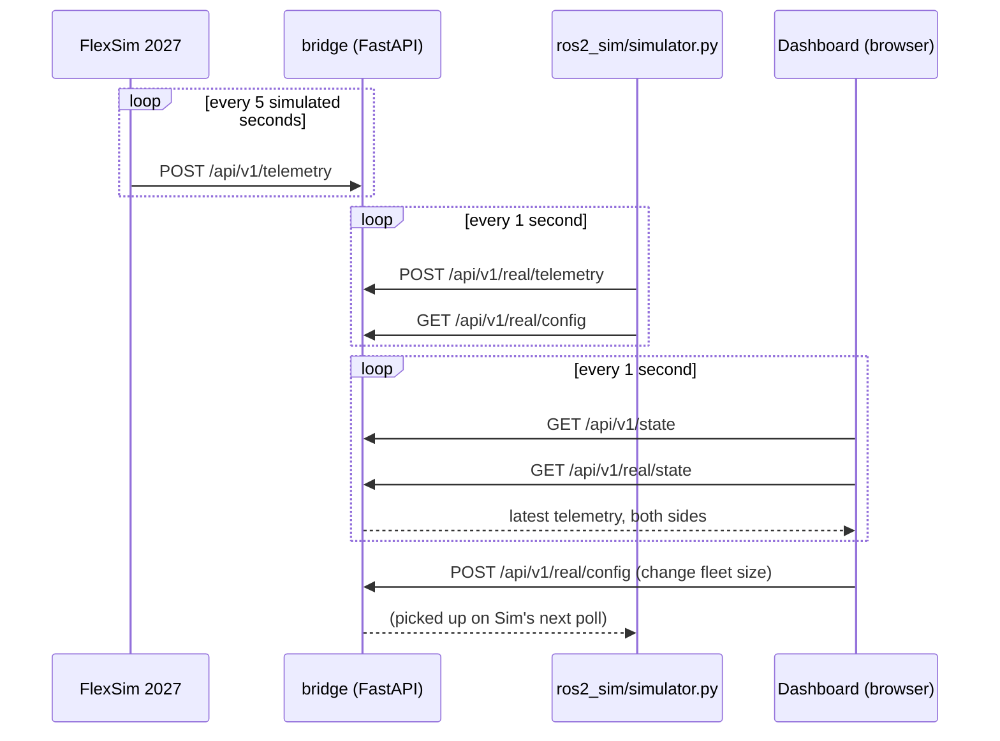

# FlexSim Digital Twin

[](LICENSE)
[](https://www.python.org/)
[](https://fastapi.tiangolo.com/)
[](https://docs.pydantic.dev/)
[](https://pytest.org/)
[](#quick-start-no-coding-experience-needed)
[](https://www.flexsim.com/)

A working digital-twin integration, running locally: a real **FlexSim
2027** warehouse model, a **Python bridge** that exposes its live state
over HTTP/JSON, a **live dashboard**, and a physics-based **mock robot
fleet** standing in for a future ROS2-connected real system. The two
sides are compared side by side, so a question like "how many robots
before this queue backs up?" has a testable answer today, not just a
theoretical one.

## Quick start (no coding experience needed)

Two files, two double-clicks, no commands to type.

1. **Install Python** (only once, if you don't already have it):
   [python.org/downloads](https://www.python.org/downloads/), download,
   run the installer, check **"Add python.exe to PATH"**, then Install.
2. Download or `git clone` this repository, then open the `bridge` folder.
3. **Double-click `start.bat`.** A black window opens, sets things up the
   first time (takes about a minute), starts the server, and your
   browser opens automatically to the live dashboard. Leave that window
   open; closing it stops the server.
4. Optional, to see the "real robots" side of the comparison: also
   **double-click `start_ros2_sim.bat`**. A second window opens showing a
   simulated robot fleet moving totes, and the dashboard's "Digital Twin
   Comparison" section comes alive. Use the number box on the dashboard
   to change how many robots there are and watch the effect right away.

That's it. `http://127.0.0.1:8000/dashboard` is now live in your browser.
To connect the actual FlexSim 2027 model instead of just the mock
simulation, see [Connecting FlexSim](#connecting-flexsim) below.

<details>
<summary><b>Quick start for developers (command line)</b></summary>

```powershell
git clone https://github.com/Pouya-Mansournia/flexsim-digital-twin.git
cd flexsim-digital-twin\bridge
.\run.ps1
```

This creates a `.venv`, installs dependencies, and starts the bridge on
`http://127.0.0.1:8000`. In a second terminal, to also run the mock real
environment:

```powershell
cd flexsim-digital-twin\bridge
.venv\Scripts\python.exe ros2_sim\simulator.py --robots 2
```

Run the test suite:

```powershell
cd flexsim-digital-twin\bridge
.venv\Scripts\Activate.ps1
pytest
```

</details>

## What this is



- **FlexSim side**: a Process Flow loop inside the model posts real
  queue contents, processor utilization, robot position/speed, and
  throughput counters to the bridge every 5 simulated seconds. No manual
  steps once it's wired up.
- **Bridge**: a small FastAPI service that stores the latest telemetry
  from both sides (FlexSim and the "real" environment) independently,
  serves it over REST, and renders a live comparison dashboard.
- **ros2_sim**: a standalone Python simulation of a robot fleet with
  realistic acceleration and deceleration, a steady tote arrival rate,
  and a fleet size you can change live from the dashboard, so you can
  watch backlog grow or drain as robots are added or removed, before any
  real hardware or ROS2 stack is involved. Phase 2 swaps this for a real
  ROS2 node behind the same API, with no changes to the bridge.


<sub>The actual FlexSim 2027 model (`flexsim-model/DG-FT-01.fsm`) this project is built against: an Inbound sortation cell feeding an Outbound put-wall/rack area.</sub>

## Repository layout

```text
flexsim-digital-twin/
├── flexsim-model/            FlexSim 2027 model
│   └── DG-FT-01.fsm
│
├── bridge/                    Python middleware (FastAPI + dashboard)
│   ├── app/                    Application source
│   │   ├── api/                  telemetry, real-environment, commands, dashboard
│   │   ├── models/                Pydantic schemas
│   │   ├── services/              in-memory state stores
│   │   └── core/                   config, logging
│   ├── flexsim/                 FlexSim-side integration docs
│   │   └── verified_scripts/       tested FlexScript + every gotcha found
│   ├── ros2_sim/                 mock real-environment robot fleet
│   ├── tests/                    pytest suite (19 tests)
│   ├── start.bat                  double-click to set up and run (Windows)
│   ├── start_ros2_sim.bat          double-click to run the mock fleet
│   ├── run.ps1                     what start.bat calls under the hood
│   └── README.md                   full bridge documentation
│
├── assets/                    Images used in this README
├── LICENSE
└── README.md                  you are here
```

## The dashboard

The single most useful entry point once everything is running:
`http://127.0.0.1:8000/dashboard`.

- **FlexSim section**: queue levels (current and peak), processor
  state/utilization, entry/exit throughput counters, robot
  position/speed.
- **Digital Twin Comparison section**: FlexSim's queues plotted next to
  the real/ROS2-side environment's queues, a live fleet-size control for
  the real environment, a backlog metric with a smoothed trend
  indicator, and the real side's robot table.
- Light/dark theme, a Reset button, auto-refresh every second. No
  external JS or CSS dependencies; it's a single self-contained HTML page
  served by FastAPI.

## Architecture: runtime flow



The two telemetry channels never merge. `state_store` holds FlexSim's
latest snapshot, `real_environment_store` holds the real/ROS2 side's, and
the dashboard reads both independently to render the comparison.

## Connecting FlexSim

`start.bat` (or `.\run.ps1`) gives you the bridge and the mock
real-environment side; no FlexSim installation is required for that. To
also see live telemetry from the actual model:

1. Install FlexSim 2027 and open `flexsim-model\DG-FT-01.fsm`.
2. Follow [`bridge/flexsim/verified_scripts/README.md`](bridge/flexsim/verified_scripts/README.md).
   It has the exact, tested FlexScript
   ([`final_telemetry_custom_code.fsc`](bridge/flexsim/verified_scripts/final_telemetry_custom_code.fsc))
   to paste in, and every gotcha found getting it working: a Windows
   Firewall rule that silently blocks FlexSim, a case-sensitive API call
   that fails with no visible error, object paths that aren't where you'd
   expect.
3. Run the model. Its queues, processors, and robots start appearing on
   the dashboard next to the mock real environment.

## What we actually learned building this

The value here isn't only the code. It's a trail of concrete, verified
findings from getting a real FlexSim 2027 model talking to external
software, none of which were obvious from the documentation:

- FlexSim 2027 has a real `Http.Request`/`Http.Response` FlexScript API,
  but the method enum (`Http.Method.Post`) is case-sensitive in a way
  that fails silently: a wrong-case value compiles, runs, and quietly
  sends a `GET` instead of a `POST`, with no error anywhere in FlexSim.
- Windows Firewall can block FlexSim's outbound traffic, even to
  `127.0.0.1`, with zero error surfaced in FlexSim.
- `Model.find("ObjectName")` fails silently (it returns an unusable node,
  not an error) if the object is nested inside a group or plane rather
  than at the model root. Four of this model's most important queues
  (`Queue1`–`Queue4`) were nested this way, so telemetry silently read 0
  for them until we found it by checking the object's real path in
  FlexSim's status bar.
- Model Parameters used as counters or accumulators need `Continuous`
  type and explicit, wide bounds. `Integer` type silently rounds
  fractional values, and the default `Lower Bound = 1` silently clamps
  any attempt to reset a value to `0`.
- FlexSim has no single built-in "items in/out" counter for an arbitrary
  point in a line. This project wires it up using existing Photo Eye
  objects' `On Cover` trigger, incrementing a named Model Parameter.

The full trail, including the exact FlexScript that works and why, is in
[`bridge/flexsim/verified_scripts/README.md`](bridge/flexsim/verified_scripts/README.md).

## A finding from the model itself

Running this integration surfaced a real bottleneck in `DG-FT-01.fsm`,
not just a software one. `Queue1` (Inbound) was observed with 172 totes
in, 35 out, 137 sitting in the queue, and an average wait time over 12
minutes: a genuine capacity mismatch downstream, visible precisely
because the telemetry was flowing correctly. That's the point of a
digital twin: it surfaces real problems, not only simulated ones.

## Built with

| Layer | Technology |
|---|---|
| Simulation | [FlexSim 2027](https://www.flexsim.com/) (FlexScript) |
| API server | [Python 3.11+](https://www.python.org/), [FastAPI](https://fastapi.tiangolo.com/), [Uvicorn](https://www.uvicorn.org/) |
| Validation | [Pydantic](https://docs.pydantic.dev/) |
| Dashboard | Vanilla HTML/CSS/JS, `<canvas>` charts (no frontend framework, no build step) |
| Real-environment simulator | Python, [httpx](https://www.python-httpx.org/) |
| Testing | [pytest](https://pytest.org/) |
| Future (Phase 2) | ROS 2 |

## Limitations

- Localhost-only; no authentication or TLS on the bridge's API.
- Single FlexSim model instance and single bridge instance: no
  multi-tenant routing.
- The mock real-environment fleet (`ros2_sim/simulator.py`) is a
  simplified physics model (constant acceleration, no obstacle avoidance
  or path planning), not a robotics simulator. It's built to answer
  fleet-sizing questions, not to validate control algorithms.
- The command interface (bridge → FlexSim) is implemented and
  unit-tested but not yet exercised against a real FlexSim consumer
  polling and acknowledging commands.
- In-memory storage only; state is lost on restart by design (see
  `bridge/README.md` for the persistence-ready interface this is built
  behind).

## Roadmap

**Phase 1, done and working end to end:**
- FlexSim to bridge over local HTTP/JSON.
- Live dashboard with FlexSim-vs-real comparison.
- Mock real-environment robot fleet with a live-configurable size.
- Command interface (`POST /api/v1/commands`, poll, ack): implemented and
  unit-tested, not yet exercised against a real FlexSim consumer.

**Phase 2, not started:**
- A ROS2 node replacing `ros2_sim/simulator.py`, publishing to real
  topics (`/warehouse/state`, `/amr/state`, `/flexsim/events`) and
  consuming commands, behind the same `/api/v1/real/*` API with no
  changes to the bridge.
- FlexSim executing commands the bridge hands it (the reverse direction:
  bridge to FlexSim), currently implemented server-side but not yet
  wired into the model.

## Contributing

Issues and PRs welcome. See [CONTRIBUTING.md](CONTRIBUTING.md) for setup,
test instructions, and project conventions.

## License

[MIT](LICENSE)
