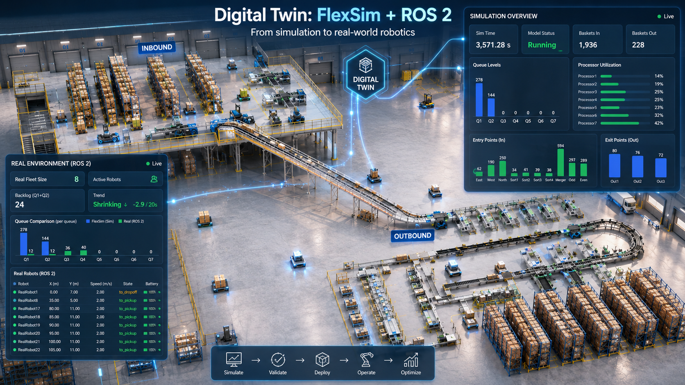
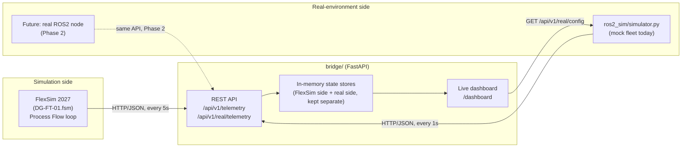
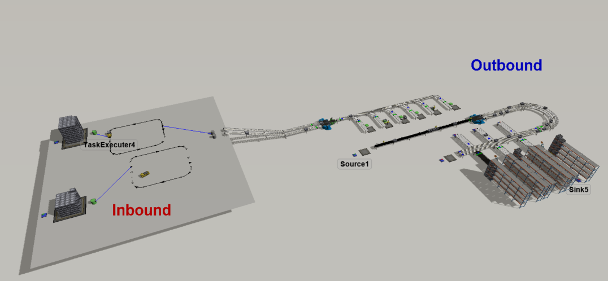
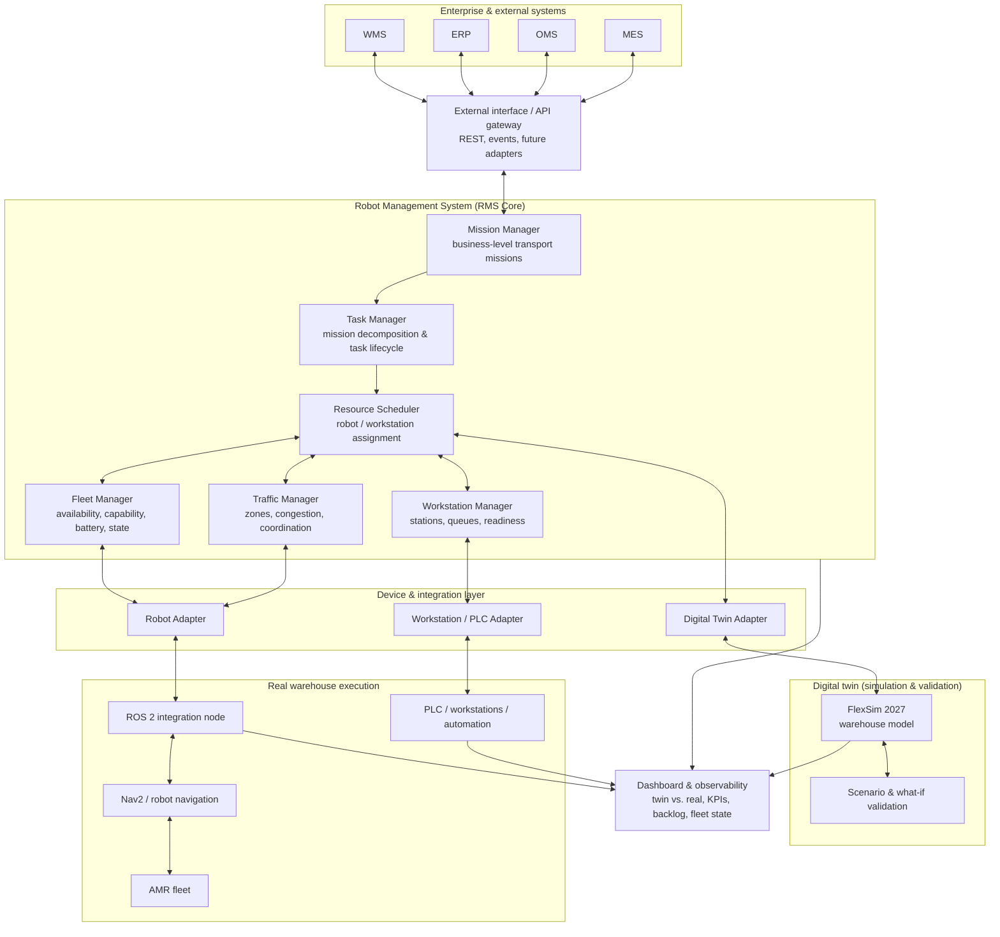
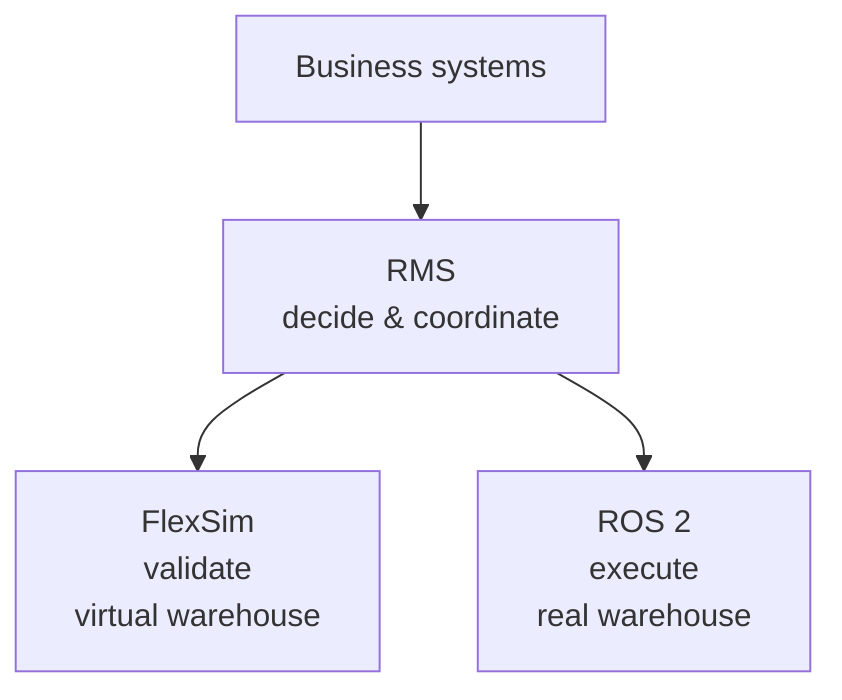
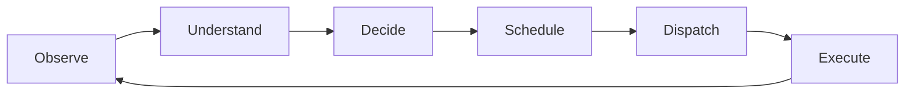
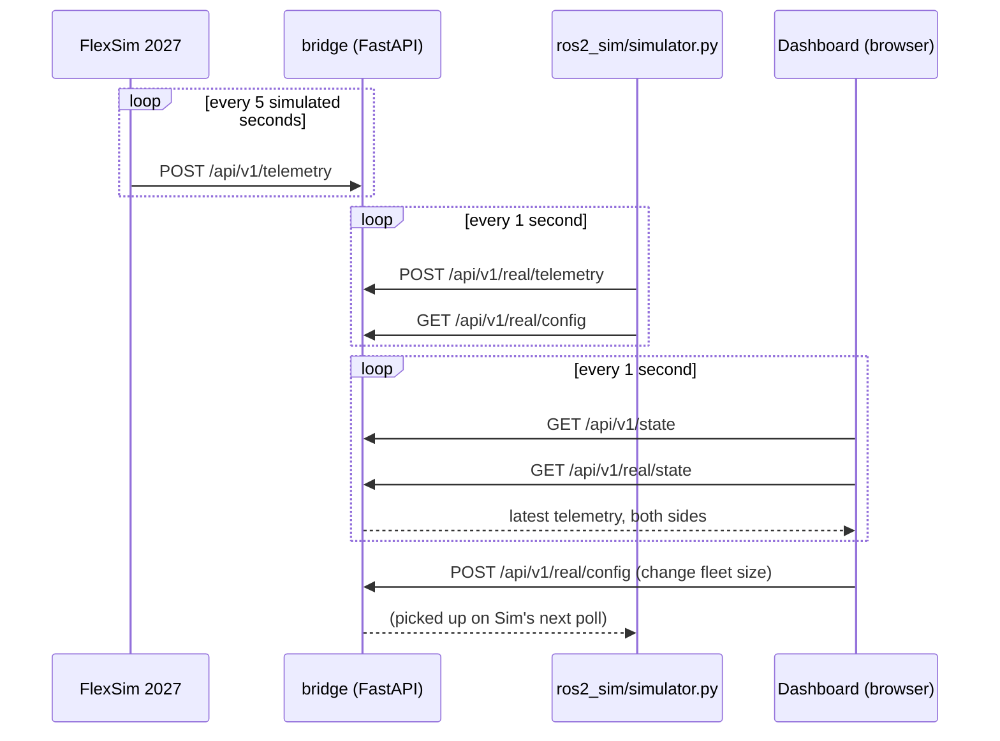

# FlexSim Digital Twin

[](LICENSE)
[](https://www.python.org/)
[](https://fastapi.tiangolo.com/)
[](https://docs.pydantic.dev/)
[](https://pytest.org/)
[](#quick-start-no-coding-experience-needed)
[](https://www.flexsim.com/)

A working digital-twin integration, running locally: a real **FlexSim
2027** warehouse model, a **Python bridge** that exposes its live state
over HTTP/JSON, a **live dashboard**, and a physics-based **mock robot
fleet** standing in for a future ROS2-connected real system. The two
sides are compared side by side, so a question like "how many robots
before this queue backs up?" has a testable answer today, not just a
theoretical one.

## Quick start (no coding experience needed)

One double-click, or three separate ones if you'd rather start each
piece on its own.

1. **Install Python** (only once, if you don't already have it):
   [python.org/downloads](https://www.python.org/downloads/), download,
   run the installer, check **"Add python.exe to PATH"**, then Install.
2. Download or `git clone` this repository.
3. **Double-click `start_all.bat`** in the repository root. It opens
   the bridge in its own window (setting things up the first time,
   about a minute), opens the mock real-environment fleet in a second
   window, runs one RMS scheduling decision so the dashboard has
   something to show right away, and opens your browser to the live
   dashboard automatically. Close the "FlexSim Bridge" or "ROS2 Mock
   Fleet" windows to stop those pieces.

Prefer to start things one at a time (or only some of them)? Every
piece `start_all.bat` runs also works completely on its own:

| Double-click | Starts |
|---|---|
| `bridge\start.bat` | Just the bridge + dashboard |
| `bridge\start_ros2_sim.bat` | Just the mock robot fleet (after the bridge is up) |
| `python examples\live_flexsim_rms_demo.py` | Just one RMS scheduling run (needs a command line) |

That's it. `http://127.0.0.1:8000/dashboard` is now live in your browser.
To connect the actual FlexSim 2027 model instead of just the mock
simulation, see [Connecting FlexSim](#connecting-flexsim) below.

<details>
<summary><b>Quick start for developers (command line)</b></summary>

```powershell
git clone https://github.com/Pouya-Mansournia/flexsim-digital-twin.git
cd flexsim-digital-twin\bridge
.\run.ps1
```

This creates a `.venv`, installs dependencies, and starts the bridge on
`http://127.0.0.1:8000`. In a second terminal, to also run the mock real
environment:

```powershell
cd flexsim-digital-twin\bridge
.venv\Scripts\python.exe ros2_sim\simulator.py --robots 2
```

Run the test suite:

```powershell
cd flexsim-digital-twin\bridge
.venv\Scripts\Activate.ps1
pytest
```

</details>

## What this is



- **FlexSim side**: a Process Flow loop inside the model posts real
  queue contents, processor utilization, robot position/speed, and
  throughput counters to the bridge every 5 simulated seconds. No manual
  steps once it's wired up.
- **Bridge**: a small FastAPI service that stores the latest telemetry
  from both sides (FlexSim and the "real" environment) independently,
  serves it over REST, and renders a live comparison dashboard.
- **ros2_sim**: a standalone Python simulation of a robot fleet with
  realistic acceleration and deceleration, a steady tote arrival rate,
  and a fleet size you can change live from the dashboard, so you can
  watch backlog grow or drain as robots are added or removed, before any
  real hardware or ROS2 stack is involved. Phase 2 swaps this for a real
  ROS2 node behind the same API, with no changes to the bridge.



<sub>The actual FlexSim 2027 model (`flexsim-model/DG-FT-01.fsm`) this project is built against: an Inbound sortation cell feeding an Outbound put-wall/rack area.</sub>

## Vision: toward a Robot Management System (RMS)

The working integration above is the foundation for something bigger:
this project is evolving from a FlexSim digital-twin integration into a
modular **Robot Management System (RMS)** for warehouse automation, with
mission management, task orchestration, resource scheduling, fleet
management, traffic coordination, and workstation integration sitting on
top of it.

The design principle stays simple:

> **FlexSim validates decisions. RMS makes decisions. ROS 2 executes
> robot-level behavior.**

That separation keeps orchestration logic independent of any one
simulator, robot vendor, or warehouse system, so the RMS stays useful
even if the simulation platform or robot fleet changes underneath it.



| Layer | Responsibility |
|---|---|
| WMS / ERP / OMS / MES | Business demand, inventory, orders, warehouse workflows |
| External Interface | Stable boundary between enterprise systems and the RMS |
| Mission Manager | Converts external requests into transport/robotic missions |
| Task Manager | Breaks missions into executable tasks and tracks their lifecycle |
| Resource Scheduler | Picks the best robot/workstation/resource for each task |
| Fleet Manager | Tracks robot capability, availability, battery, and state |
| Traffic Manager | Coordinates shared-space traffic, congestion, zone reservations |
| Workstation Manager | Tracks workstation availability, queues, readiness |
| Device Adapters | Isolate the RMS from robot, PLC, simulator, and vendor protocols |
| FlexSim | Digital twin, capacity analysis, what-if simulation, decision validation |
| ROS 2 / Nav2 | Robot-side execution, navigation, hardware integration |
| Dashboard | Operational observability and digital-twin/real-system comparison |

### FlexSim is not the RMS



This lets the RMS keep working even if the simulation platform or robot
vendor changes; future adapters can support other simulation or
execution environments without rewriting the RMS core.

### From observation to a decide-and-execute loop

Today the system closes the *observation* side of the loop: telemetry
flows from the model into the bridge into dashboard state. The RMS
extends this into a full loop:



A future mission might look like:

```json
{
  "mission_id": "mission-128",
  "type": "move_tote",
  "source": "Inbound",
  "destination": "Workstation-03",
  "priority": 7
}
```

The Resource Scheduler would weigh fleet state (robot availability,
battery, travel cost, current utilization) and assign it, say, to
`AMR-02` heading to `Workstation-03`. The same assignment logic could
then run inside FlexSim for validation, inside the mock environment
during development, or through ROS 2 against a real AMR, without
changing the scheduling code itself.

An initial scheduler score might look like:

```text
score(robot, task) = w1 * travel_cost + w2 * battery_penalty
                    + w3 * queue_cost + w4 * utilization_cost
                    + w5 * priority_penalty
```

starting with deterministic heuristics (nearest-available, FIFO,
priority-based, battery-aware, congestion-aware) before anything
optimization- or learning-based, so results stay understandable and
reproducible. FlexSim becomes the environment for comparing these
policies under repeatable conditions before any of them touch a real
robot.

### Development roadmap

**Phase 1, Digital Twin Foundation, done and working:**
- FlexSim 2027 warehouse model talking to a FastAPI bridge over
  HTTP/JSON.
- Queue, processor, robot, and throughput telemetry.
- Separate real/mock environment telemetry channel.
- Live dashboard, configurable mock robot fleet, command API, automated
  tests, verified FlexScript integration.

**Phase 2, close the simulation control loop, next:**
- FlexSim polling and executing commands, with acknowledgment, so the
  bridge to FlexSim direction is exercised end to end (not just
  implemented server-side, as it is today).
- Command lifecycle visibility, failure and timeout handling.

**Phase 3, RMS Core:**
- Domain model, Mission Manager, Task Manager, Resource Scheduler, Fleet
  Manager, Workstation Manager.
- An initial deterministic scheduling policy and a mission/task state
  machine, instrumented with scheduler KPIs.

**Phase 4, ROS 2 execution:**
- A ROS 2 adapter replacing the mock fleet with a ROS 2-connected
  environment: robot-state ingestion, RMS task dispatch, Nav2
  integration, mission feedback, fault and battery/state handling.

**Phase 5, traffic management:**
- Zone model, route reservations, congestion metrics, deadlock
  prevention, multi-robot coordination, dynamic replanning signals.

**Phase 6, enterprise & workstation integration:**
- An external API contract, WMS/OMS/MES adapter patterns, a workstation
  abstraction, a PLC/OPC UA adapter, inventory/order context.

**Phase 7, simulation-validated scheduling:**
- Scheduling-policy comparison, fleet-sizing experiments, failure and
  workstation-outage scenarios, demand-surge and battery/charging
  scenarios, all evaluated by KPI.

### Design principles

1. **The RMS owns orchestration.** Business-level robot decisions belong
   in the RMS, not in FlexSim or individual robot controllers.
2. **FlexSim owns simulation.** It models warehouse behavior and
   validates operational decisions, nothing more.
3. **ROS 2 owns robot integration.** It connects the RMS to navigation,
   localization, robot drivers, and real hardware.
4. **Adapters protect the core.** The RMS domain shouldn't depend
   directly on FlexScript, ROS messages, PLC protocols, or WMS-specific
   schemas.
5. **Simulation and reality stay distinguishable.** Digital-twin state
   and real-system state remain independently observable, never merged
   (see the note on Reset behavior in [`bridge/README.md`](bridge/README.md)).
6. **Start deterministic.** The first scheduler should be understandable,
   measurable, and reproducible before any optimization or learning is
   introduced.
7. **Every decision should be measurable.** Scheduling policies get
   evaluated against explicit operational KPIs, not intuition.

### Key KPIs the architecture is meant to support

| Category | Examples |
|---|---|
| Warehouse | Throughput, order cycle time, queue length and wait time, workstation utilization, bottleneck duration |
| Fleet | Robot utilization, idle time, mission completion time, distance traveled, battery/charging time, failed missions |
| Scheduler | Assignment latency, task waiting time, reassignment count, workload balance, congestion impact |
| Digital twin | Simulated vs. real throughput and cycle time, queue deviation, fleet utilization deviation, prediction error |

### Target repository structure

`rms/` and `adapters/` already exist, and the first vertical slice
closes end to end against the real `bridge/`:

```text
FlexSim -> bridge -> FlexSimAdapter.get_robots() -> FleetManager
    -> MissionManager.create_mission() -> TaskManager
    -> ResourceScheduler -> selected Robot
    -> FlexSimAdapter.send_command() -> bridge /api/v1/commands
```

`rms/missions`, `rms/tasks`, `rms/fleet`, `rms/workstations`,
`rms/scheduler`, and `rms/services` (the orchestrator tying them
together) have working, unit-tested implementations; so does
`adapters/flexsim`, talking to the real bridge over `urllib` (no extra
dependency). Run it live yourself, with `bridge/` up, via
[`examples/live_flexsim_rms_demo.py`](examples/live_flexsim_rms_demo.py):

```powershell
python examples\live_flexsim_rms_demo.py
```

The scheduler's `queue_cost` and `utilization_cost` terms are wired in
too now: `queue_cost` comes from real FlexSim queue backlog via
`FlexSimAdapter.get_workstations()`, and `utilization_cost` is the
scheduler's own running per-robot assignment count, for basic load
balancing between otherwise-equal robots. The scheduler also refuses to
dispatch toward a workstation it knows can't accept work right now
(blocked, faulted, starved, or offline): stopping FlexSim marks its
queues offline, and the orchestrator declines instead of sending a
robot toward a queue that isn't moving. `rms/traffic` now has a real
in-memory zone-reservation implementation too, though it isn't wired
into the scheduler yet. `adapters/` (`ros2/`, `plc/`, `external/`) is
still interfaces only.

Every live run also shows up on the dashboard: `bridge/` has a new
`POST`/`GET /api/v1/rms/decision` endpoint (read-only observability, the
bridge never acts on it), and the dashboard's "RMS Scheduling Decision"
panel polls it live, showing the selected robot, score, and full cost
breakdown from the run you triggered with
`python examples\live_flexsim_rms_demo.py`.
Unit tests (`pytest` from the repository root) need nothing running;
one integration test additionally exercises the live path and
self-skips if `bridge/` isn't up. See [`rms/README.md`](rms/README.md)
and [`adapters/README.md`](adapters/README.md).

```text
flexsim-digital-twin/
├── rms/                RMS core: missions, tasks, scheduler, fleet,
│                        traffic, workstations, domain model
├── adapters/            flexsim/, ros2/, plc/, external/
├── bridge/               api/, services/, dashboard/
├── flexsim-model/
├── tests/
├── assets/
└── README.md
```

Nothing in `rms/` or `adapters/` is wired into `bridge/` yet; the
working system today is exactly what's documented in "Repository
layout" below.

## Repository layout

```text
flexsim-digital-twin/
├── flexsim-model/            FlexSim 2027 model
│   └── DG-FT-01.fsm
│
├── bridge/                    Python middleware (FastAPI + dashboard)
│   ├── app/                    Application source
│   │   ├── api/                  telemetry, real-environment, rms decisions, commands, dashboard
│   │   ├── models/                Pydantic schemas
│   │   ├── services/              in-memory state stores
│   │   └── core/                   config, logging
│   ├── flexsim/                 FlexSim-side integration docs
│   │   └── verified_scripts/       tested FlexScript + every gotcha found
│   ├── ros2_sim/                 mock real-environment robot fleet
│   ├── tests/                    pytest suite (25 tests)
│   ├── start.bat                  double-click to set up and run just the bridge
│   ├── start_ros2_sim.bat          double-click to run just the mock fleet
│   ├── run.ps1                     what start.bat calls under the hood
│   └── README.md                   full bridge documentation
│
├── rms/                        Robot Management System core (see its README)
│   ├── domain/, missions/, tasks/, fleet/, workstations/,
│   │   scheduler/, traffic/, services/
│   └── README.md
├── adapters/                   flexsim/ (implemented), ros2/, plc/, external/ (interfaces)
├── examples/
│   └── live_flexsim_rms_demo.py   one live RMS scheduling run against the real bridge
├── tests/                      rms/ + adapters/ unit tests (pytest from repo root)
│
├── start_all.bat               double-click to start the bridge + mock fleet + one RMS run
├── assets/                    Images used in this README
├── LICENSE
└── README.md                  you are here
```

## The dashboard

The single most useful entry point once everything is running:
`http://127.0.0.1:8000/dashboard`.

- **FlexSim section**: queue levels (current and peak), processor
  state/utilization, entry/exit throughput counters, robot
  position/speed.
- **Digital Twin Comparison section**: FlexSim's queues plotted next to
  the real/ROS2-side environment's queues, a live fleet-size control for
  the real environment, a backlog metric with a smoothed trend
  indicator, and the real side's robot table.
- Light/dark theme, a Reset button, auto-refresh every second. No
  external JS or CSS dependencies; it's a single self-contained HTML page
  served by FastAPI.

## Architecture: runtime flow



The two telemetry channels never merge. `state_store` holds FlexSim's
latest snapshot, `real_environment_store` holds the real/ROS2 side's, and
the dashboard reads both independently to render the comparison.

## Connecting FlexSim

`start.bat` (or `.\run.ps1`) gives you the bridge and the mock
real-environment side; no FlexSim installation is required for that. To
also see live telemetry from the actual model:

1. Install FlexSim 2027 and open `flexsim-model\DG-FT-01.fsm`.
2. Follow [`bridge/flexsim/verified_scripts/README.md`](bridge/flexsim/verified_scripts/README.md).
   It has the exact, tested FlexScript
   ([`final_telemetry_custom_code.fsc`](bridge/flexsim/verified_scripts/final_telemetry_custom_code.fsc))
   to paste in, and every gotcha found getting it working: a Windows
   Firewall rule that silently blocks FlexSim, a case-sensitive API call
   that fails with no visible error, object paths that aren't where you'd
   expect.
3. Run the model. Its queues, processors, and robots start appearing on
   the dashboard next to the mock real environment.

## What we actually learned building this

The value here isn't only the code. It's a trail of concrete, verified
findings from getting a real FlexSim 2027 model talking to external
software, none of which were obvious from the documentation:

- FlexSim 2027 has a real `Http.Request`/`Http.Response` FlexScript API,
  but the method enum (`Http.Method.Post`) is case-sensitive in a way
  that fails silently: a wrong-case value compiles, runs, and quietly
  sends a `GET` instead of a `POST`, with no error anywhere in FlexSim.
- Windows Firewall can block FlexSim's outbound traffic, even to
  `127.0.0.1`, with zero error surfaced in FlexSim.
- `Model.find("ObjectName")` fails silently (it returns an unusable node,
  not an error) if the object is nested inside a group or plane rather
  than at the model root. Four of this model's most important queues
  (`Queue1`–`Queue4`) were nested this way, so telemetry silently read 0
  for them until we found it by checking the object's real path in
  FlexSim's status bar.
- Model Parameters used as counters or accumulators need `Continuous`
  type and explicit, wide bounds. `Integer` type silently rounds
  fractional values, and the default `Lower Bound = 1` silently clamps
  any attempt to reset a value to `0`.
- FlexSim has no single built-in "items in/out" counter for an arbitrary
  point in a line. This project wires it up using existing Photo Eye
  objects' `On Cover` trigger, incrementing a named Model Parameter.

The full trail, including the exact FlexScript that works and why, is in
[`bridge/flexsim/verified_scripts/README.md`](bridge/flexsim/verified_scripts/README.md).

## A finding from the model itself

Running this integration surfaced a real bottleneck in `DG-FT-01.fsm`,
not just a software one. `Queue1` (Inbound) was observed with 172 totes
in, 35 out, 137 sitting in the queue, and an average wait time over 12
minutes: a genuine capacity mismatch downstream, visible precisely
because the telemetry was flowing correctly. That's the point of a
digital twin: it surfaces real problems, not only simulated ones.

## Built with

| Layer | Technology |
|---|---|
| Simulation | [FlexSim 2027](https://www.flexsim.com/) (FlexScript) |
| API server | [Python 3.11+](https://www.python.org/), [FastAPI](https://fastapi.tiangolo.com/), [Uvicorn](https://www.uvicorn.org/) |
| Validation | [Pydantic](https://docs.pydantic.dev/) |
| Dashboard | Vanilla HTML/CSS/JS, `<canvas>` charts (no frontend framework, no build step) |
| Real-environment simulator | Python, [httpx](https://www.python-httpx.org/) |
| Testing | [pytest](https://pytest.org/) |
| Future (Phase 2+) | ROS 2, Nav2, an RMS core in Python, OPC UA/PLC adapters |

## Limitations

- Localhost-only; no authentication or TLS on the bridge's API.
- Single FlexSim model instance and single bridge instance: no
  multi-tenant routing.
- The mock real-environment fleet (`ros2_sim/simulator.py`) is a
  simplified physics model (constant acceleration, no obstacle avoidance
  or path planning), not a robotics simulator. It's built to answer
  fleet-sizing questions, not to validate control algorithms.
- The command interface (bridge → FlexSim) is implemented and
  unit-tested but not yet exercised against a real FlexSim consumer
  polling and acknowledging commands.
- In-memory storage only; state is lost on restart by design (see
  `bridge/README.md` for the persistence-ready interface this is built
  behind).

## Roadmap

Phase 1 (this repository, today) is done and working end to end: FlexSim
to bridge over local HTTP/JSON, a live dashboard with FlexSim-vs-real
comparison, a mock real-environment robot fleet with a live-configurable
size, and a command interface (`POST /api/v1/commands`, poll, ack) that's
implemented and unit-tested but not yet exercised against a real FlexSim
consumer.

Beyond Phase 1, this project is meant to grow into a full Robot
Management System, not just a ROS2 swap-in. See
[Vision: toward a Robot Management System (RMS)](#vision-toward-a-robot-management-system-rms)
above for the complete phase-by-phase roadmap (closing the FlexSim
command loop, the RMS core, ROS 2 execution, traffic management,
enterprise integration, and simulation-validated scheduling).

## Contributing

Issues and PRs welcome. See [CONTRIBUTING.md](CONTRIBUTING.md) for setup,
test instructions, and project conventions.

## License

[MIT](LICENSE)
